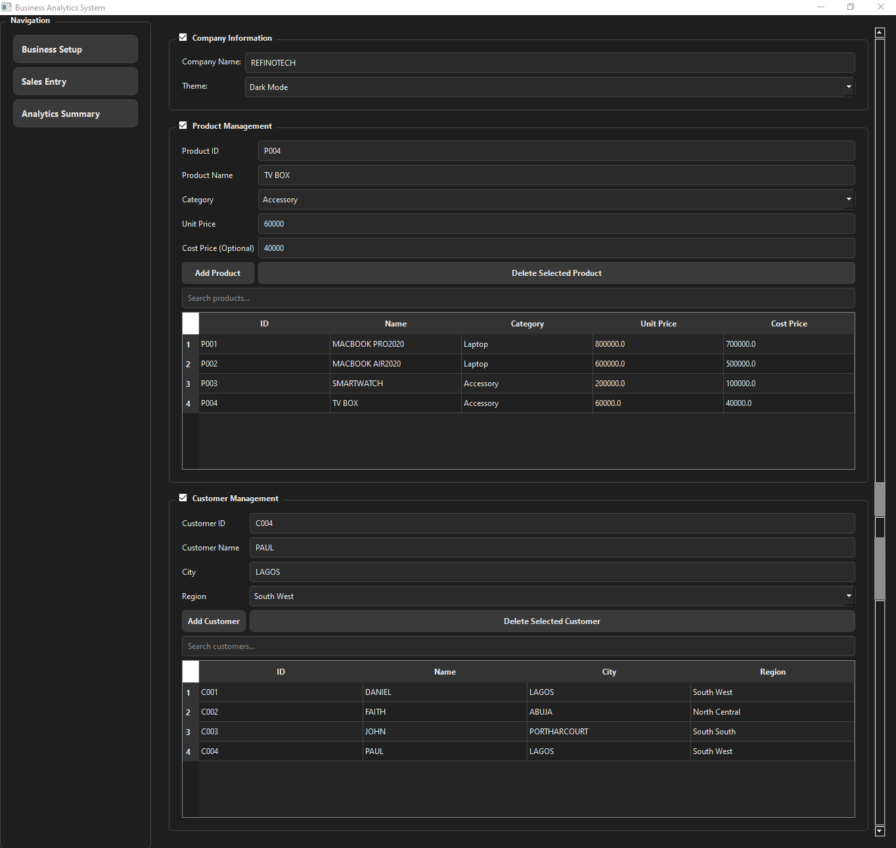
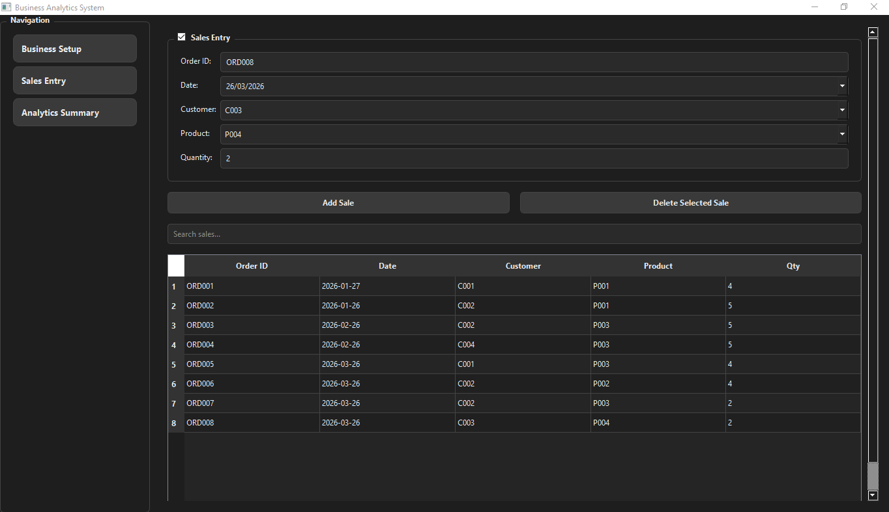
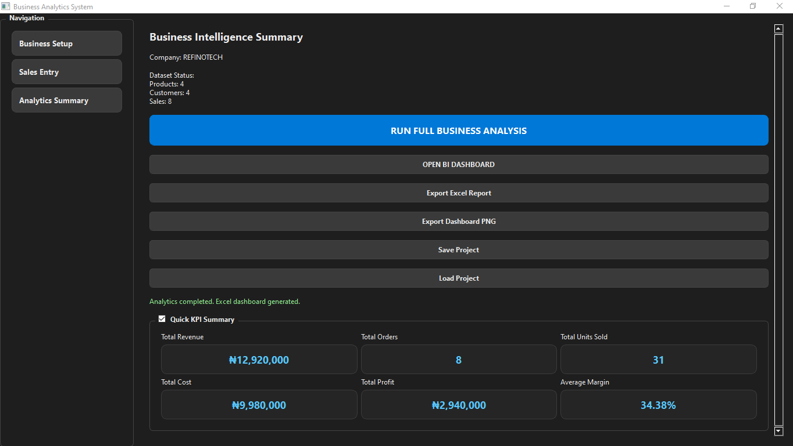
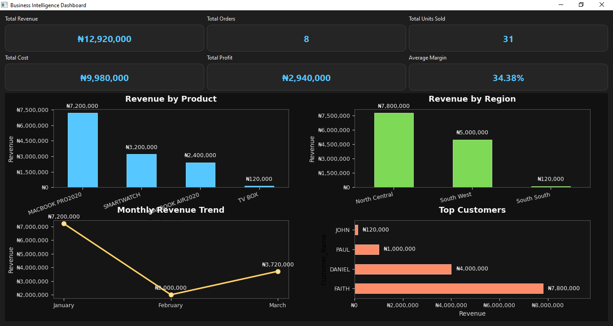
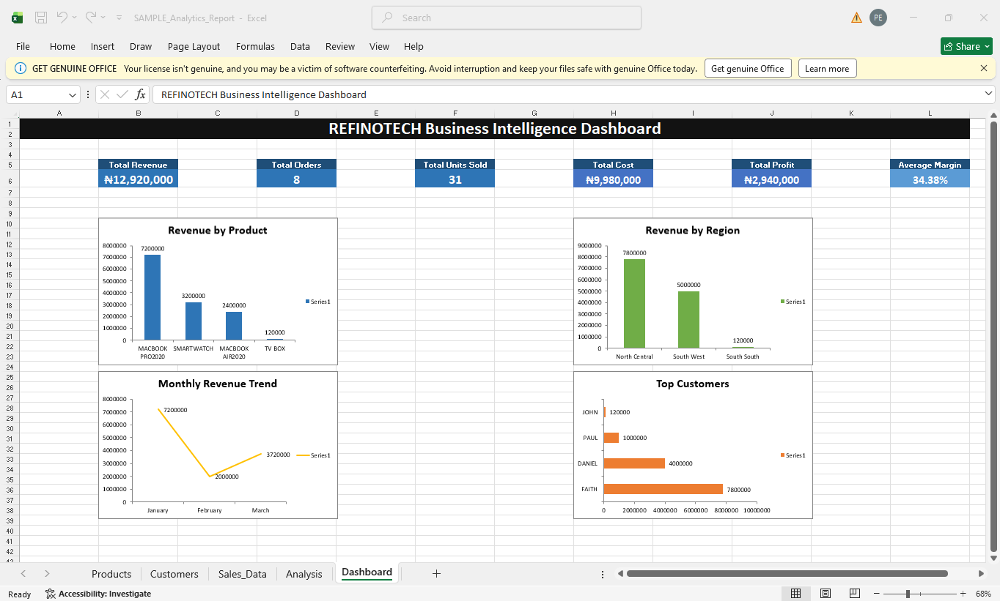

# Business Analytics Tool

A desktop business analytics application built with Python and PyQt5.

## What it does

This app helps businesses:

- manage products
- manage customers
- record sales
- generate KPI summaries
- visualize revenue with charts
- export analysis to Excel

## Tech stack

- Python
- PyQt5
- pandas
- matplotlib

## Screenshots

### Business Setup


### Sales Entry


### Analytics Summary


### Dashboard



## Run locally

```bash
python main.py